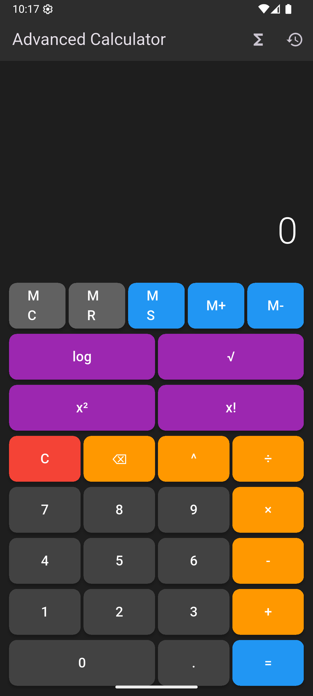

# 🧮 Advanced Flutter Calculator

A comprehensive calculator app built with Flutter that demonstrates advanced Dart programming concepts, stateful widget management, and professional UI design patterns.

## Screenshots

<div align="center">  </div>

## 📱 Features

### ✨ Core Functionality
- **Basic Arithmetic**: Addition, subtraction, multiplication, division
- **Scientific Functions**: sin, cos, tan, log, sqrt, power, factorial
- **Memory Operations**: Store, recall, add, subtract, clear memory
- **Calculation History**: Track and review previous calculations
- **Expression Evaluation**: Support for complex mathematical expressions

### 🎨 User Interface
- **Dark Theme**: Professional dark mode interface
- **Responsive Design**: Adapts to different screen sizes
- **Animated Interactions**: Smooth button press animations
- **Haptic Feedback**: Tactile feedback for different operations
- **Mode Switching**: Toggle between basic and scientific modes
- **Visual Indicators**: Memory status and calculation state display

### 🔧 Advanced Features
- **Real-time Expression Preview**: See your calculation as you type
- **History Panel**: Expandable history with timestamp tracking
- **Error Handling**: Graceful error management and user feedback
- **Memory Persistence**: Memory values maintained during session
- **Scientific Mode**: Extended functions for advanced calculations

## 🚀 Getting Started

### Prerequisites
- Flutter SDK (>=3.0.0)
- Dart SDK (>=2.17.0)
- Android Studio / VS Code with Flutter extensions
- Android emulator or physical device

### Installation

1. **Clone the repository**
   ```bash
   git clone https://github.com/misterbrown3404/calculator.git
   cd flutter-calculator
   ```

2. **Install dependencies**
   ```bash
   flutter pub get
   ```

3. **Run the application**
   ```bash
   flutter run
   ```

### Building for Production

```bash
# Build APK
flutter build apk --release

# Build iOS (on macOS)
flutter build ios --release

# Build for web
flutter build web
```

## 🏗️ Architecture

### Project Structure
```
lib/
├── main.dart                 # App entry point and configuration
├── model/
│   ├── calculation_history.dart
│   └── memory_manager.dart
├── service/
│   └── calculator_engine.dart
├── screen/
│   └── calculator_screen.dart


### Key Components

#### 🎯 **CalculatorEngine**
- Static methods for mathematical operations
- Expression parsing and evaluation
- Scientific function implementations
- Error handling for invalid expressions

#### 💾 **MemoryManager**
- Encapsulates memory operations (MC, MR, MS, M+, M-)
- Thread-safe memory value management
- Visual memory indicator support

#### 📊 **CalculationHistory**
- Immutable data model for calculation records
- Timestamp tracking for history entries
- Formatted display for previous calculations

#### 🎨 **CalculatorScreen**
- Main stateful widget managing app state
- Animation controllers for smooth interactions
- Responsive layout with conditional rendering

## 🤝 Contributing

1. Fork the repository
2. Create a feature branch (`git checkout -b feature/amazing-feature`)
3. Commit your changes (`git commit -m 'Add amazing feature'`)
4. Push to the branch (`git push origin feature/amazing-feature`)
5. Open a Pull Request

### Code Style
- Follow [Dart Style Guide](https://dart.dev/guides/language/effective-dart/style)
- Use meaningful variable and function names
- Add comments for complex logic
- Maintain consistent formatting


## 🙏 Acknowledgments

- Flutter team for the amazing framework
- Material Design for UI guidelines
- Dart language team for excellent documentation
- Community contributors and testers


**Made with ❤️ using Flutter**

*A comprehensive calculator demonstrating advanced Flutter development patterns and best practices.*